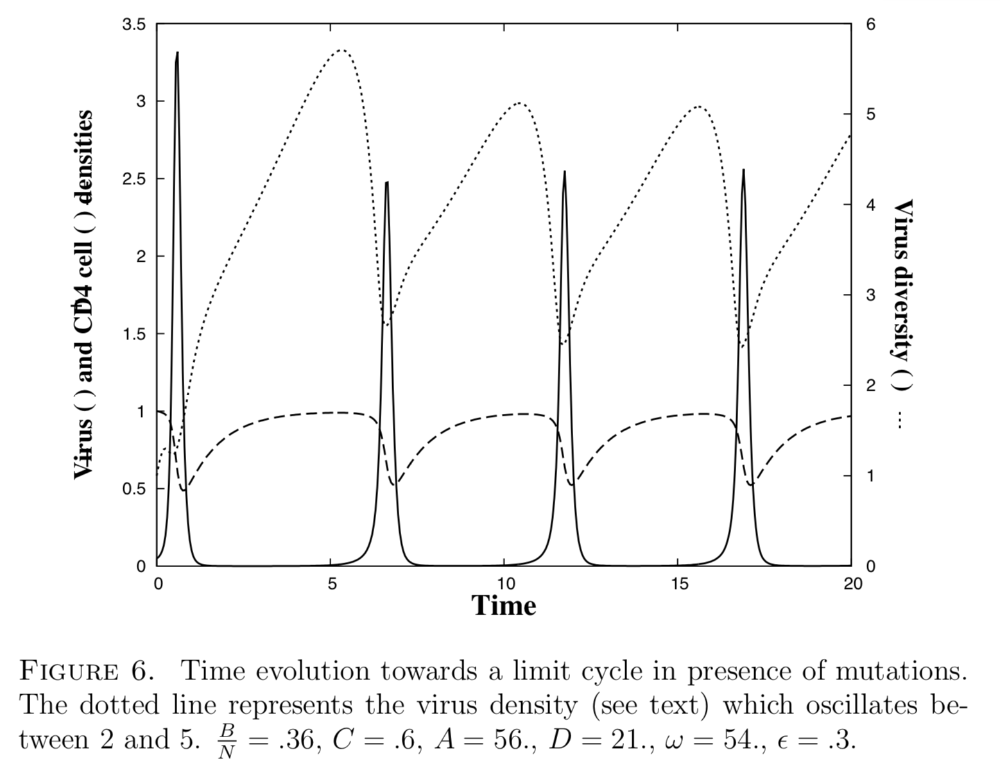
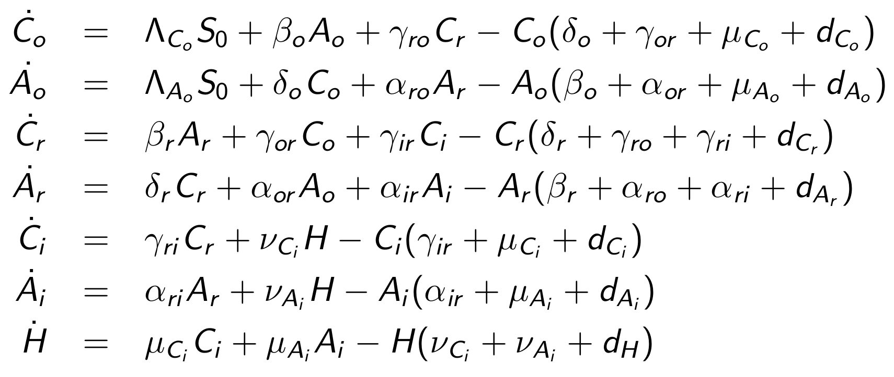
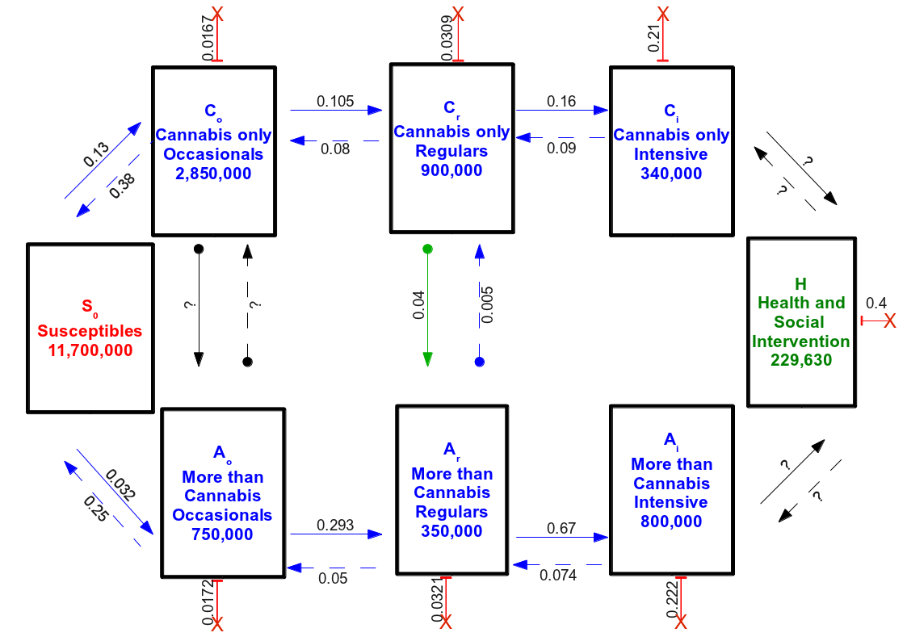
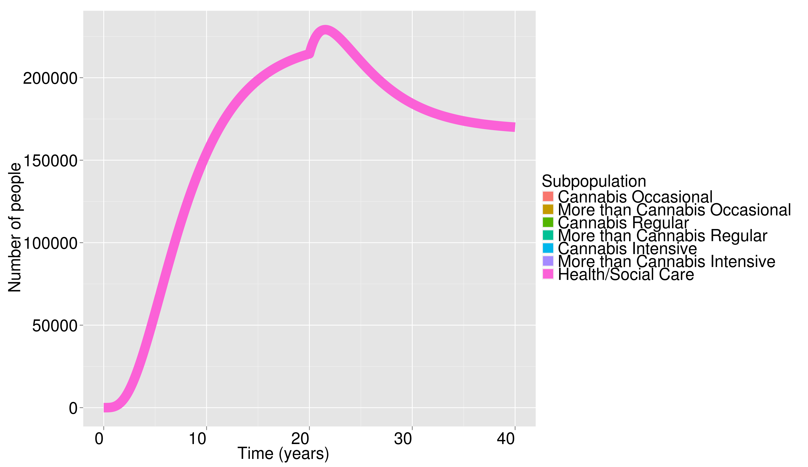
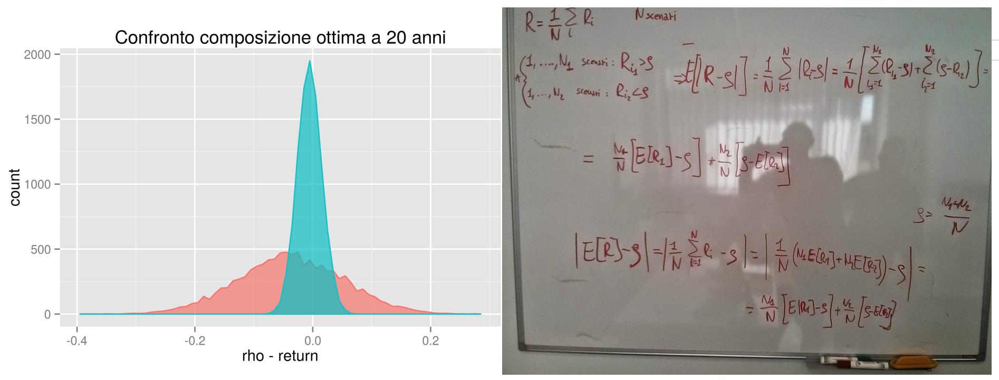
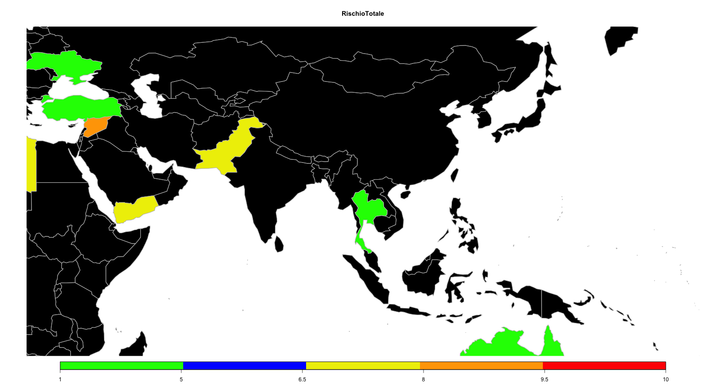
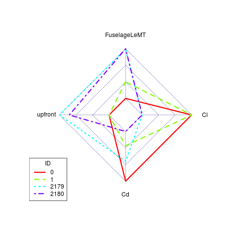
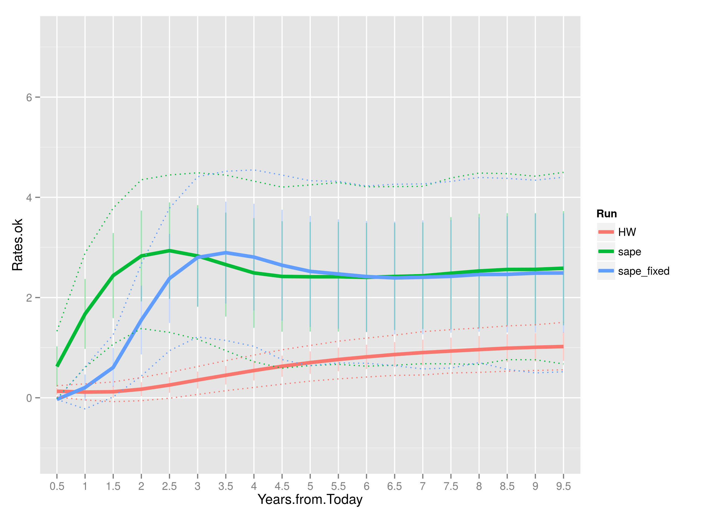
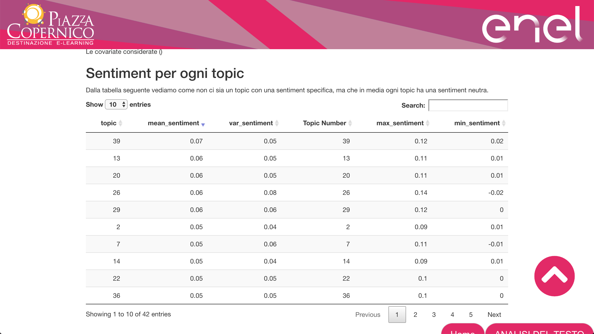

# The Past (2005-2015)                                {data-background="img/The_Past.JPG" data-background-size="105%" data-background-position="bottom"}

##  COMPETING HIV STRAINS AND IMMUNE SYSTEM RESPONSE (2005-2009 until 2011)  {data-background="img/GST.png" data-background-size="75%"}
<small>

-  PhD Thesis  

-  A 'simple' deterministic model which describes an asymmetric competition between an immune system with a specific and powerful response, and a virus with a broad toxicity and fast mutations.   

-  In spite of it simplicity, it reproduces some of the features of the asymptomatic phase of the infection by HIV-1. In particular, there is a domain of parameters in which the dynamics is characterized by the apparition of “blips”, associated here to an instability which develops at high virus reproduction rate. 
-  A domain of parameters in which the dynamics is characterized by the apparition of “blips”, associated here to an instability which develops at high virus reproduction rate.  
</small>

## COMPETING HIV STRAINS AND IMMUNE SYSTEM RESPONSE (2005-2009 until 2011)
<small>

Two sets of population: Viruses( HIV strains $V_\sigma$) and Immune System (CD4$^+$ T cells $X_\sigma$) where $\sigma \in S$ and $S$ a simple genomic space $S={1,...,N}$

We do not describe directly a population of infected cells, assuming that the virus dynamics is fast enough so that both population densities stay strongly coupled at all times. Finally we also assume that the mean densities are the only variable which matters, irrespective of the repartition in the body and the possible interaction with other agents  

</small>
$$
\begin{eqnarray*}
\frac{dX_\sigma}{dt}&=&\frac{\Lambda_0}{N}\left(1+\frac{DV_\sigma}{1+V^T} \right) - X_\sigma\left(1+V^T+AV_\sigma \right) \\
\frac{dV_\sigma}{dt}&=&\omega V_\sigma\left( X^T - BX_\sigma - C\right) + \epsilon (\Delta V)_\sigma
\end{eqnarray*}
$$
 

## COMPETING HIV STRAINS AND IMMUNE SYSTEM RESPONSE (2005-2009 until 2011)

<small>

A "predator-predator" model   $->$ The birth rates of both increase with the density of the other  

Rich dynamics from the asymmetry in the behavior $->$ Virus prey on globally while immune systems prey on specific strain

For a particular set of parameters, peaks of virus density appear in some cases as a consequence of a too high virus replication rate $->$ reminding of the clinically observed blips as a consequence of instability

For details $->$ arXiv:1101.2851 [q-bio.QM]
</small>

   
   

## Data Analisys on AIDS (HIV-Infected Patients) (2005-2009) {data-background="img/HIV_Therapy.gif"}
<small>

-  Journal of Antimicrobial Chemotherapy (2006) 58, 714–722:  
  
    +  Estimation of Probability to observe mutations at position 38 over time during HAAR Therapy   
    +  Using a Multinomial Distribution at each time step    
    +  The $p_i$ are estimated using the MLE ($\frac{x_i}{n}$)   
 

- 
 AIDS RESEARCH AND HUMAN RETROVIRUSES Volume 25, Number 1, 2009  and Antiviral Therapy 2013; 18:867-876 

    +  Evolution of drug resistance mutations during Treatment Interruption     
    +  Using a survival (Kaplan-Mayer estimation) approach for the NRTI resistance mutations   
    +  Estimation of the median time of disappearance (95% CI) of any resistance mutations considered   
 

-  Short communications: 

    +  The 13th Conference on Retroviruses and Opportunistic Infections, CROI2006, poter M-145 
    +  The 20th International Conference on Antiviral Research, 2007, doi:10.1016/j.antiviral.2007.01.013 
 

</small>

## Data Emission Estimation and Mortatility in the Ciampino Municipality and sourrounding (2006-2007) {data-background="img/copertina.jpg" data-background-size="17%" data-background-position="left"}

<small>
  
- Valutazione del rischio ambientale del comune di Ciampino in relazione all’inquinamento atmosferico (2007): 
  
    +  Using of the DPSIR Model with the EMEP/CORINAIR and NAMEA-EUROSTAT Estimation Models. Data finding, normalization and linking 
    +  Definition of Density of Emission Pressure: $DE_jk = \frac{E_k}{S_jP_j}$. $E_k$ emission of the $k$ type, $S_j$ surface of the area (city, province, state,..) $j$ with population  $P_j$  
 

-  Studio della Mortalità per cause nel Comune di Ciampino e comuni limitrofi negli anni 1987-2002 (2007): 

    +  Mortality in Ciampino Municipality and sourroundings from 1987 to 2002 
    +  Preventing the lack of specific data we defined the Standardized Mortality Ratio $SMR^i_{tjx}$  for the cause $i$, in an interval of time $t$, for the gender $j$, for the class interval $x$ 
    + $SMR^i_{tjx} = \frac{D^i_{tjx}}{m_{tjx}*P^i_{tjx}}$  where $D$ is the death rate (i.e. in Ciampino municipality), $m$ the 'aspected' mortality rate, i.e. in Italy, and $P$ the population (i.e. in Ciampino)
 
</small>

## A compartmental model of drug users (2006-2007) 

  
<small>   

- A six-typology compartment model of trends in use of illicit drugs in Italy $->$ to evaluate policies and interventions through scenario analyses.  
 
- Inside the big compartments of just-cannabis users and multiple-drug users three users subpopulation: **occasional**, **regular**, **intensive**

- Compartments for health care/assisted persons together with a constant source (susceptible) are added
  
</small>

 

## Data Scientist at Center for Molecular Allergology (CAM) (2009-2012 still active low-effort collaboration)  {data-background="img/Interall.png" data-background-size="75%"}

<small>
  
 - Data from intensive clinical routine ($~10$K test/year, each test with more tha $100$ molecule)  
   
 -  A brand new test in allergology $->$ definition of appropriate statistical analisys and new (in allergology) paradigms of visulization 
  
    +  Implementation of cluster analisys: Hierarchical and not using euclidean and binary dissimilarity measures; cluster dendrograms and correlation-trees   
      
    +  Graphical calculation of Venn's Diagrams for showing cross-positivity to up to 4 allergene, Circular highly customizable barplot   
      
    +  Spatial statistics on sensitivy to various allergens (Allergome.org) 
      
    +  Implementation of an allergy risk index using profile of allergic sensitization and a database of food ingredient for allergenes diffusion (AllergomeConsumer ifarai.org)
      
    +  Hard coding effort with R, MySql and PHP for Data Cleaning/Preprocessing, Analysis and Visulization   
</small>

## Data Scientist at Center for Molecular Allergology (CAM) (2009-2012)  {data-background="img/Interall.png" data-background-size="75%"}

<small>
  

 -  More details on  
  
    +  PLoS ONE Vol. 6, 9, 2011 DOI:10.1371/journal.pone.0024912   
    +  PLoS ONE Vol. 6, 11, 2011 DOI:10.1371/journal.pone.0027856  
    +  PLoS ONE Vol. 7, 4, 2012 DOI:10.1371/journal.pone.0035697 
    +  PLoS ONE Vol. 7, 7, 2012 DOI:10.1371/journal.pone.0040945 
    +  Clinical and Experimental Allergy, 2012, Vol. 42, 3, 441-450 DOI:10.1111/j.1365-2222.2011.03915.x
    +  Molecular Immunology, 2015, Vol. 66, 2, 154-163 DOI:10.1016/j.molimm.2015.02.025
    +  Journal of Agricultural and Food Chemistry, 2015, Vol. 63, 29, 6567-6576 DOI:10.1021/acs.jafc.5b02159

</small>

##  Tecnology Translator at SMII (Mathematical Desk for the Italian Industry ) (2013-2014)  {data-background="img/SMII.png" data-background-size="90%"}

<small>
  
 -  Definition of the working paradigms  

-  Creation and implementation of the network of scientific (nationally and internationally) and development partners 

-  Creation of the web site, various slides and presentations, implementation of the Customer Relationship Database, reports and statitics of the project activities   

-  Over 50 personal meeting with italian firms with 3 signed collaborations    

</small>

## Early steps as IAC research fellow (2014-2015) 

  
<small>   

- Toy-model with exact analytical solution to evaluate the cost function of Unicredit Asset Liability Management Model and proposal of new one with better convergence  
 
- Creation and implementation of TH.E.SYS, THREAT EVALUATION SYSTEM, evaluation procedure of the state risk for a private corporation. TH.E.SYS is a a composite index from multiple etherogenous sources. I can't say more than that... 
  
</small>

  

##  Early steps as IAC research fellow (2014-2015)  {data-background="img/R_logo.png"}

  
<small>   
 Some scripts for generating graphs and analisys of simulations in the application developed for the project  RBF4AERO  
</small>

<small>
 Toy model (Hull-White) with exact analitycal solution in order to benchmark the model and the simulation of Credit Value Adjustment developed for Italian Ministery of Finance and Economics (SAPE model) 
</small>

 

# The Present (2016-2018)   {data-background="img/The_Present.JPG" data-background-size="30%"}

## Natural Language Processing

- Use of probabilistic model like **Topic Model** and **GloVE** in order to:  

    + Select most informative documents in a corpus  
    + Detect relevant differencies between documents
    + Resolve the disambiguation
    + Perform a classification/partitioning of document sets based on their content  
    
- Have a relatively good computation performance  

- Define a standard in data preprocessing and visualization

## Extension of The Structural Topic Model (STM)
<small>  

- STM allows incorporating tags, categories, metadata and other information accompanying the text archive   

- STM uses covariate information to parametrize the prior distributions to potentially affect both topical prevalence and topical content  

- STM use the Bag Of Word approach (forget the word order in the text!)

- We extended STM so it can take into account properly multi words token (N-grams)

- from STM (Bag-Of-Word) to ExtendedSTM (Bag-of-Ngrams)  

- Technically we are acting on vocabulary matrix and updating the document with the most probable N-gram according to probablity distributions calculated using STM. doi:10.1109/ICSC.2018.00048  
  
</small>

## Extension of The Structural Topic Model (STM)
<small>  
  
- In Indexing of Anonimous Networks for Crime Information Search (IANCIS) we performed a complete crawling of four famous ToR drug marketplaces: Alphabay, Crypto Market, East India and Nucleus   

- We used E-STM to analize the dataset 

- As an example in the topic 30 (called Methamphetamine),the highest score tokens were: ice, meth, crystal_meth, shards, crystal_methamphetamine, 0.5g_crystal_methamphetamine.

- We can also see that in Nucleus (0.0218) the topic is 2 times more prevalent respect the others (0.0114)

- The coherence and the intelligibility of the obtained topics were significantly enhanced  

</small>

## Sentiment E-STM
<small>
  
- What they speaking about? -> Topic Model  

- They have a positive or negative opinion? -> Sentiment Analisys

- **Idea**: What is the opinion about different arguments not know? -> Sentiment E-STM

- What the problem? E-STM is working well with document (many sentences) while Sentiment Analisys with sigle sentence.  

- **Idea**: Divide every document in at least 3 subdocuments (negative, neutral, positive polarity) then using the $K-$ dimensional $\vec{\theta_d}$ (probabilities of sub-document $d$ to stay in topics $1,...,K$) to compute a distribution of polarity scores for every topic.  
  
</small>

## Sentiment E-STM
<small>
  
- In collaboration with **Piazza Copernico** Sentiment E-STM was applied to employee satisfaction survey of italian division of ENEL S.p.A.  

</small>

## CircSpaceTime: An R Package for Spatial and Spatio-Temporal Models for Circular Data{data-background-image="img/wave07.gif"}
<small>  

- Currently the following models are implemented:   

- Spatial Wrapped Normal: given $Y \in R$ a random Normal variable ($f_Y(y) \sim N(\mu, \sigma^2)$), $\Theta = Y \; mod \; 2\pi$ in $[0,2\pi)$ is circular. Then $f_\Theta(\theta) \sim \sum_{k=-\infty}^{\infty} f_Y(\theta+2\pi k)$  

- Spatial Projected Normal: given $\mathbf{Y} = (Y_1, Y_2)$ a bivariate vector, $\mathbf{U} =\frac{\mathbf{Y}}{||\mathbf{Y}||}$ is a point over the unit circle then $\Theta$ $->$ $U_1=cos(\Theta)$, $U_2=sin(\Theta)$. Then $\mathbf{Y}=(Y_1,Y_2)=R(cos\theta , sin\theta)=R\mathbf{U}$ where $R=||\mathbf{Y}||$
and $f_\Theta(\theta)=\int_{R^+} rf_\mathbf{Y}((rcos\theta , rsin\theta)')dr$  

- The work as be accepted and will be published on JSS Special Issue on Bayesian Statistics in the second half of 2019. For now http://santoroma.github.io/CircSpaceTime/
 

</small>

# The Future  {data-background-color="#ffffff" data-background-image="img/The_Future.gif" data-background-size="60%"}

## Beyond E-STM
<small>  

- Time to go deep inside the model: we want to see some semantic aspects using topic model 

- The prevalence covariate Matrix $X$ is affecting only the expected value of the logitNormal distribution. The probability vector of document $d$ containing the $K-1$ topics (the last one is done!) $\mathbf{\theta_d^{K-1}} \sim LogitNormal_{K-1}(\Gamma^TX^T, \Sigma)$  
- **Idea**: Maybe the correlation between topics can dramatically change respect to specific covariates value. We want to create a correlation structure for the topics depending on covariates S $\mathbf{\theta_d^{K-1}} \sim LogitNormal_{K-1}(\Gamma^TX^T, \Omega^TS^T)$ using the same structure of the $\Gamma^TX^T$, a lasso regression, or may be an elastic (L_1+L_2)...Then there is much calculation for the full a posteriori distribution and the variational E-M to use.

- In the E-STM there is no selection between a bi-gram and the two components. We can extend this idea by introducing a discrete spatial dependence for the indicator variable $z_{n,d}$ that can become a generic compound indicator. We can take into account N-grams (contiguous words) and skip-grams (not contiguous words).  

</small>  

## Beyond E-STM
<small>    

- E-STM is working with constant sparse matrix $->$ we can go to a CUDA GPU implementation for large corpora  

- In large corpora, the number of topics can be considerable $\sim 10^3$, and we can use the correlation structure to build a network of topics. The edge can be the correlation with a lower bound. Then we can study the resulting network  

- SentimentE-STM can be used with a specific polarity database. We can use STM to select most representative documents, annotate it manually, then use STM probability structure and a word network database to an expansion to all the dictionary. 

</small>  

# ... this is the END or (I hope) the beginning {data-background="img/the_end.gif"}

## THANKS!!! {data-background="img/truman_show_end.gif"}

